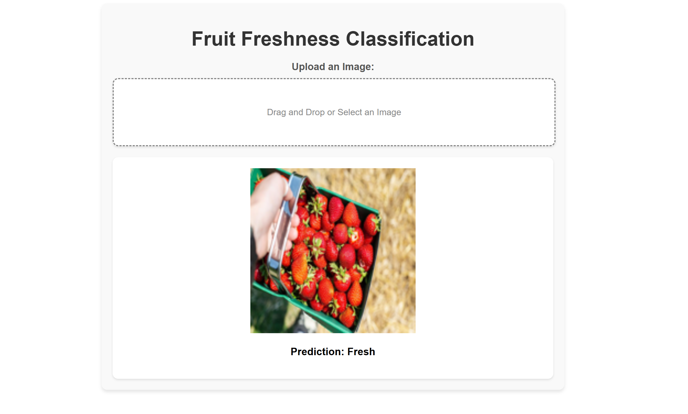

# 🍓 Fruit Freshness Classification App

This project is a deep learning-based image classification app that predicts whether a fruit is **fresh or rotten** based on a user-uploaded image. It’s built using **TensorFlow/Keras** for model training and **Streamlit** for deployment.


## 🧠 Overview

Food quality assessment is a crucial task in the food industry. This project offers a smart and lightweight tool to classify fruit freshness from images, helping reduce food waste and automate sorting processes.

## 🧪 Business Problem

Manual sorting of fruits based on freshness is time-consuming and inconsistent. There’s a growing need for a **fast, automated solution** that ensures fruit quality is monitored efficiently without human error.

## 💡 Solution

- Developed a **CNN model** trained on fruit images (Fresh vs Rotten)
- Deployed a **web app** using **Streamlit**
- Enables real-time image upload and freshness prediction

## 🔥 Features

- Upload any image of fruit and get instant prediction
- Clean, user-friendly web interface
- Efficient and fast classification using a lightweight model

## 🎯 Future Work
Extend to more fruit types (bananas, apples, etc.)

Multi-class classification (Fresh, Slightly Spoiled, Rotten)

Add real-time camera input for live predictions

Mobile-friendly UI

## 🙋‍♂️ Why This Project?
This project combines deep learning, image processing, and real-world impact. It demonstrates how AI can be applied in agriculture and retail to ensure quality and efficiency.

## 🌐 Tech Stack

- Python  
- TensorFlow / Keras  
- OpenCV / PIL  
- Streamlit (Frontend + Deployment)


## 🖼 App Preview




## ⚙️ How to Run Locally

```bash
git clone https://github.com/your-username/fruit-freshness-classification-app.git
cd fruit-freshness-classification-app
pip install -r requirements.txt
streamlit run app.py
